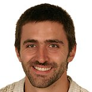

# About the software

The `trajalign` module distribution is designed to align in space and in time the trajectories of diffraction limited objects, which are imaged in living cells with fluorescence microscopy.

The original version of the software was developed in [R](www.cran.org) and is no longer mantained. The software in its original version  was used to visualise the dynamic architecture of the endocytic machineries in yeast cells ([Picco, _et al._, eLife 2015](http://dx.doi.org/10.7554/eLife.04535)) and to resolve subtle phenotypes induced by genetic mutations in the yeast cell ([Kukulski, Picco, _et al._, eLife 2016](http://dx.doi.org/10.7554/eLife.16036)).

The new version of the software here is rewritten in python, to software is more efficient, it is easier to use and its code is clearer than in the original version. 

The software was developped and is currently mantained by [Andrea Picco](https://github.com/apicco) in the [Kaksonen laboratory](http://cms.unige.ch/sciences/biochimie/-Marko-Kaksonen-.html).

***

# Licence

All the software here is distributed under the terms of the [GNU General Public License Version 3, June 2007](https://www.gnu.org/licenses/gpl.html). `trajalign` is a free software and comes with ABSOLUTELY NO WARRANTY. You are welcome to redistribute the software. However, we deeply appreciate is the use of our software would result in citations of 

[Picco, A., Kaksonen, M., _Precise tracking of the dynamics of multiple proteins in endocytic events_,  Methods in Cell Biology, Vol. 139, pages 51-68 (2017)](http://www.sciencedirect.com/science/article/pii/S0091679X16301546).

Enjoy!

***

# About the author

I am a physicist who has always been fascinated by biology and its complexity. In the field of cellular biology, I strongly believe that the careful design of quantitative microscopy experiments and a rigorous data analysis can allow scientists to visualise and understand the molecular details, and dynamics, that operate molecular machineries in biological processes, directly in living cells. Currently, I am a Mâitre assistant in the group of Professor Kaksonen. Some external links:
* [my Google scholar](https://scholar.google.ch/citations?user=LpvPoGIAAAAJ&hl=en)
* [my LinkedIN](https://ch.linkedin.com/in/andrea-picco-9b62a274)
* [my Github repository](https://github.com/apicco)
* [my Twitter](https://twitter.com/g_trevize)
* [Kaksonen laboratory](http://cms.unige.ch/sciences/biochimie/-Marko-Kaksonen-.html)

