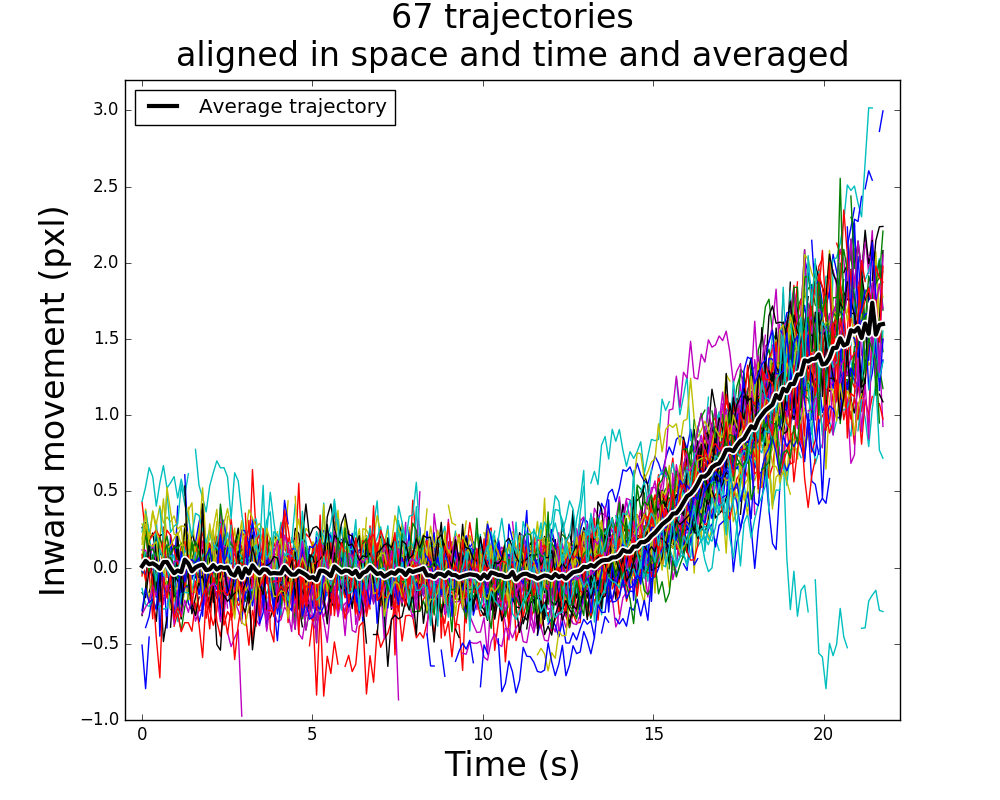

Welcome to the `trajalign` module distribution homepage! 
`trajalign` is a collection of Python modules that align in space and in time, and average, trajectories of diffraction limited object, which are recorded with fluorescence microscopy.

*The inward movement of the endocytic coat protein Sla1 during endocytosis. 67 independet  trajectories are aligned in space and time and averaged together, with `trajalign` module distribution. Generate this plot by following this [example](wiki/Averaging-trajectories-example).* 

You can [**Download**](https://github.com/apicco/trajectory_alignment/archive/master.zip) the software or visit the [github repository](https://github.com/apicco/trajectory_alignment/). If you already have downloaded `trajalign` you might want to check the [update](https://github.com/apicco/trajectory_alignment/commits/master) history to see whether significant changes have been committed to the repository since your last download.

To [install](wiki/Installation) and use the package read the [documentation](wiki/Home).

***

If you use this software, please cite: 

[Picco, A., Kaksonen, M., _Precise tracking of the dynamics of multiple proteins in endocytic events_,  Methods in Cell Biology, Vol. 139, pages 51-68 (2017)](http://www.sciencedirect.com/science/article/pii/S0091679X16301546)
