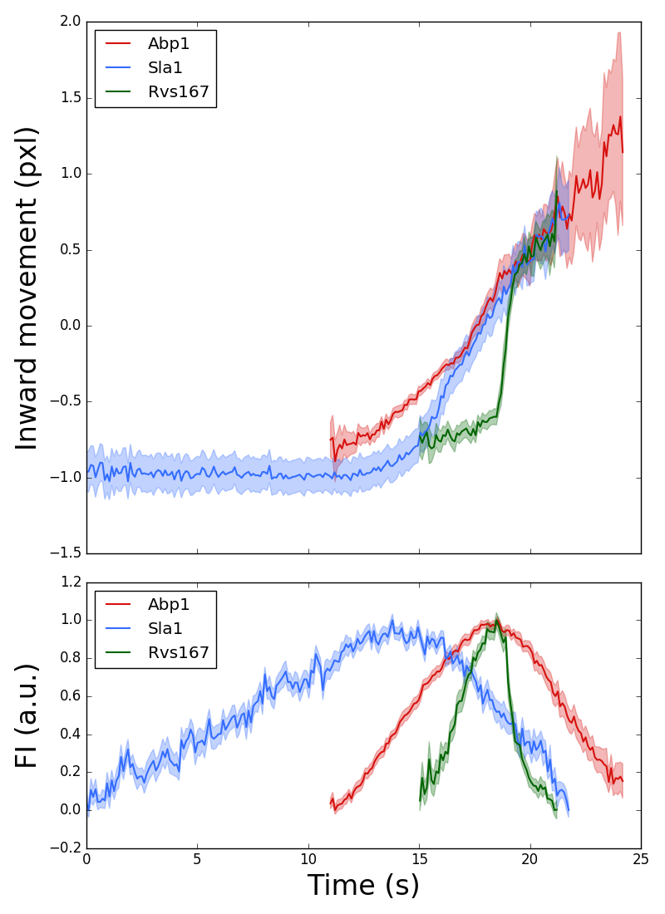

Here is an **example** about the use of the [align](Align-average-trajectories) function. 
The goal of the example is to align in space and time the average trajectories of the proteins Sla1, whose average trajectory is shown in the [home](http://apicco.github.io/trajectory_alignment/) page, and Rvs167 to the average trajectory of Abp1, which is used as a reference protein. 
The output of the example will be the following plot.

_The inward movement and the fluorescence intensity profile of the endocytic coat protein Sla1, the N-BAR protein Rvs167, and the actin binding protein Abp1._

The average trajectories are aligned together using raw trajectories that have been acquired simultaneously for Abp1 and Rvs167 or Abp1 and Sla1. 

The raw trajectories are found in the folders [abp1_and_rvs167](https://github.com/apicco/trajectory_alignment/tree/master/example/align_trajectories_example/) and [abp1_and_sla1](https://github.com/apicco/trajectory_alignment/tree/master/example/align_trajectories_example/), respectively.

The average trajectories are [sla1.txt](https://github.com/apicco/trajectory_alignment/tree/master/example/align_trajectories_example/), [rvs167.txt](https://github.com/apicco/trajectory_alignment/tree/master/example/align_trajectories_example/) and [abp1.txt](https://github.com/apicco/trajectory_alignment/tree/master/example/align_trajectories_example/). 
Following the convention in the [documentation](Align-average-trajectories), Sla1 and Rvs167 are the _target proteins_ that need to be aligned to Abp1, which is the _reference protein_. 
Abp1 average trajectory was computed using the option `fimax = True` in `average_trajectories`. That is because about half of Abp1  trajectory  tracks the random movement of the actin patch after the scission of the vesicle, when the actin network disassembles, and the random movement of the actin patches after scission can bias the computation of the  average trajectory during the invagination of the plasma membrane.

To align Sla1 to Abp1 one needs to load first the trajectory pairs that are used to compute the alignment as two list, one list contains the trajectories for Sla1 and the other list contains the trajectories for Abp1. 
The ordering of the trajectories in the two lists must match the pairing of the trajectories (the first trajectory in the Sla1 list is paired with the first trajectory in the Abp1 list and so on). 

	from trajalign.align import align
	from trajalign.average import load_directory
	
	sla1_trajectories = load_directory(
			path = 'abp1_and_sla1' , 
			pattern = '.sla1_data.txt$' ,
			comment_char = '%' , 
			dt = 0.2657 , 
			t_unit = 's' , 
			coord_unit = 'pxl' , 
			frames = 0 , 
			coord = ( 1 , 2 ) , 
			f = 3 , 
			protein = 'Sla1-GFP' , 
			date = '01/01/00' , 
			notes = 'the trajectory of the target protein')
	
	abp1_trajectories = load_directory(
			path = 'abp1_and_sla1' , 
			pattern = '.abp1_data.txt$' ,
			comment_char = '%' , 
			dt = 0.2657 , 
			t_unit = 's' , 
			coord_unit = 'pxl' , 
			frames = 0 , 
			coord = ( 1 , 2 ) , 
			f = 3 , 
			protein = 'Abp1-mCherry' , 
			date = '01/01/00' , 
			notes = 'the trajectory of the reference protein')

Note that both trajectories must have obviously the same time interval, dt, and must share the same units.
Once the trajectory pairs are loaded, the alignment can be computed by calling the [align](Align-average-trajectories) function.

	align( path_target = 'sla1.txt' , path_reference = 'abp1.txt' , ch1 = sla1_trajectories , ch2 = abp1_trajectories , fimax2 = True )

*ch1* and *ch2* are the variables that are used to enter the trajectories of the target and reference proteins, respectively. These lines of code are found in the  alignment script [align_abp1_and_sla1.py](https://github.com/apicco/trajectory_alignment/tree/master/example/align_trajectories_example/align_abp1_and_sla1.py) in the [example folder](https://github.com/apicco/trajectory_alignment/tree/master/example/align_trajectories_example).
Similarly the alignmet of Rvs167 to Abp1 is in [align_abp1_and_rvs167.py](https://github.com/apicco/trajectory_alignment/tree/master/example/align_trajectories_example/align_abp1_and_rvs167.py) in the [example folder](https://github.com/apicco/trajectory_alignment/tree/master/example/align_trajectories_example/).

To run the alignment script access through the shell the folder that contains them and type
	
	python3.5 align_abp1_and_sla1.py

and
	
	python3.5 align_abp1_and_rvs167.py

Aligned trajectories are saved with the same name as the target trajectory, followed by "_aligned". Hence, the trajectories of Sla1 and Rvs167 aligned to Abp1 will be called Sla1_aligned.txt and Rvs167_aligned.txt. These trajectories store new annotations: the name of the target trajectory, the name of the reference trajectory and the angle, translation, and lag, as well as their errors, which are used aligns the target trajectory to the reference trajectory. 

To plot the aligned trajectories together you can use the following script, where we found convenient to define an *ad hoc* function, *myplot*, which is used to plot the average trajectories and their 95% confidence interval.

	from trajalign.traj import Traj
	from numpy import transpose, concatenate
	import matplotlib
	matplotlib.use('Agg')
	from matplotlib import pyplot as plt
	from matplotlib.patches import Polygon
	
	#function to plot the average trajectories and the 95% confidence interval
	def myplot( obj , t , what , label , col , scale = 0.5 ) :
		
		x = getattr( t , '_' + what )
		x_err = getattr( t , '_' + what + '_err' )
	
		if x.ndim > 1 : 
			#then the attribute has more than one dimention and we are interested
			#only in the first one.
			x = x[ 0 ]
			x_err = x_err[ 0 ]
	
		lower_error_boundary =  transpose( 
				[ t.t() , x - 1.96 * x_err ]
				)
		upper_error_boundary =  transpose( 
				[ t.t() , x + 1.96 * x_err ] 
				)
		error_boundary = concatenate( ( 
			lower_error_boundary , upper_error_boundary[ ::-1 ] 
			) )
	
		error_area = Polygon( error_boundary , True , color = col , alpha = 0.3 )
		obj.add_patch( error_area )
	
		#plot the trajectory
		obj.plot( t.t() , x , linewidth = 1.5 , color = col , label = label )
	
	#load the aligned trajectories
	abp1 = Traj()
	abp1.load( 'abp1.txt' )
	
	sla1 = Traj()
	sla1.load( 'sla1_aligned.txt' )
	
	rvs167 = Traj()
	rvs167.load( 'rvs167_aligned.txt' )
	
	#normalise the number of molecules using the average number of molecules
	#measured in endocytic patches ( Picco et al., 2015 ).

	abp1.n_mol( 240.3 , 20.6 )
	sla1.n_mol( 47.5 , 4.5 )
	rvs167.n_mol( 51.3 , 6.3 )
	
	#set trajectories start from time = 0 s
	
	t_0 = min( concatenate(( sla1.t() , abp1.t() , rvs167.t() )) )
	abp1.input_values( 't' , abp1.t() - t_0 )
	sla1.input_values( 't' , sla1.t() - t_0 )
	rvs167.input_values( 't' , rvs167.t() - t_0 )
	
	#plot
	f, ( trj , fi ) = plt.subplots( 2 , 1 , gridspec_kw = { 'height_ratios' : [ 2 , 1 ] } , figsize = ( 8 , 11 ) , sharex = True )
	
	myplot( trj , abp1 , what = 'coord' , col = '#D7110E' , label = 'Abp1' )
	myplot( trj , sla1 , what = 'coord' , col = '#336CFF' , label = 'Sla1' )
	myplot( trj , rvs167 , what = 'coord' , col = '#006400' , label = 'Rvs167' )
	
	myplot( fi , abp1 , what = 'mol' , col = '#D7110E' , label = 'Abp1' )
	myplot( fi , sla1 , what = 'mol' , col = '#336CFF' , label = 'Sla1' )
	myplot( fi , rvs167 , what = 'mol' , col = '#006400' , label = 'Rvs167' )
	
	plt.subplot( trj )
	plt.ylabel( 'Inward movement (' + abp1.annotations( 'coord_unit' ) + ')' , fontsize = 24 )
	plt.legend( loc = 'best' )
	
	plt.subplot( fi )
	plt.ylabel( 'Number of molecules' , fontsize = 24 )
	plt.xlabel( 'Time (' + abp1.annotations( 't_unit' ) + ')' , fontsize = 24 )
	plt.legend( loc = 'best' )
	
	f.tight_layout()
	f.savefig( 'plot_aligned_trajectories.png' )
	
To run the plot script access through the shell the folder that contains it and type

	python3.5 plot_aligned_trajectories.py
	
